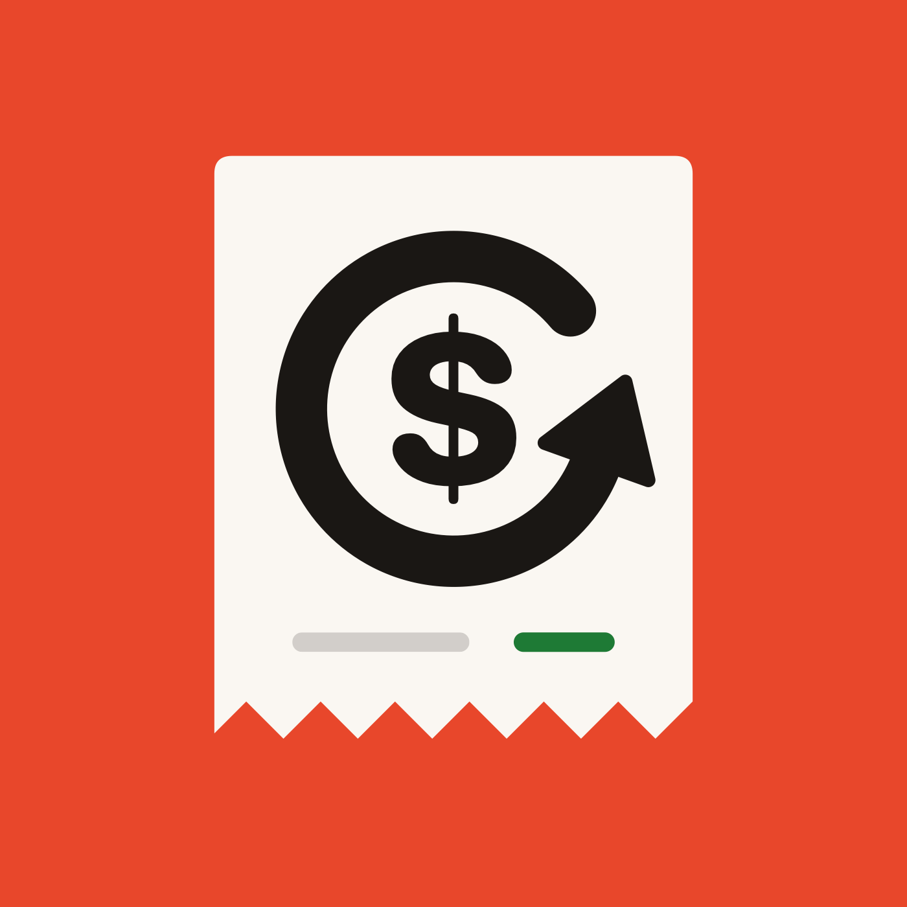
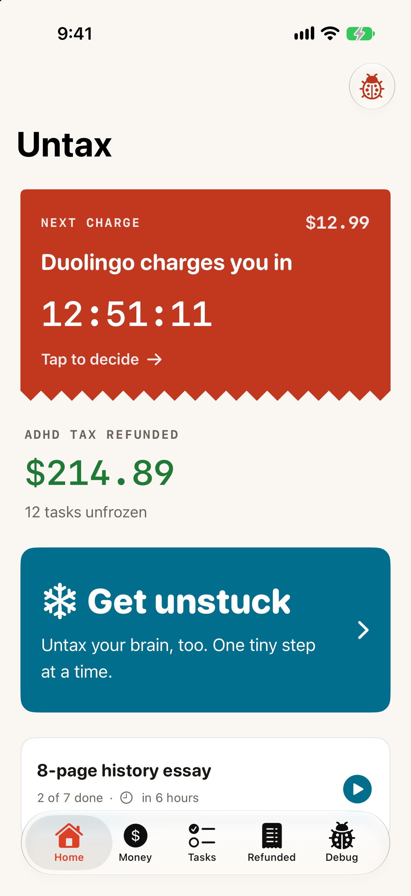
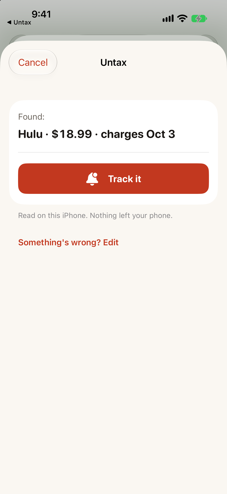
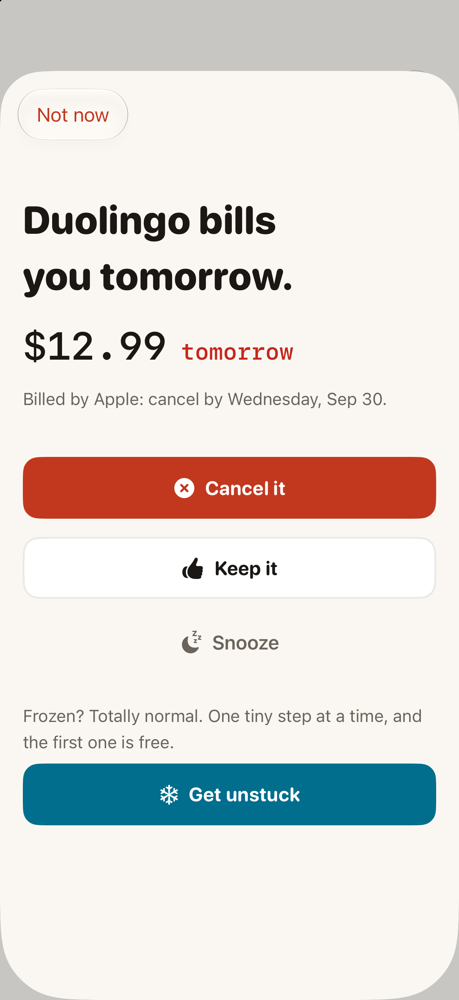
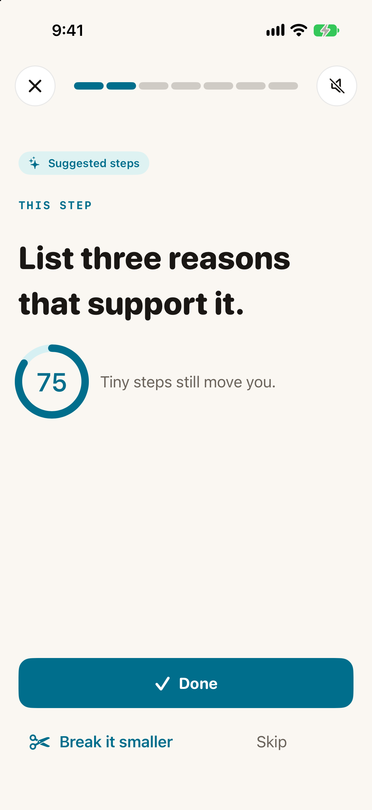
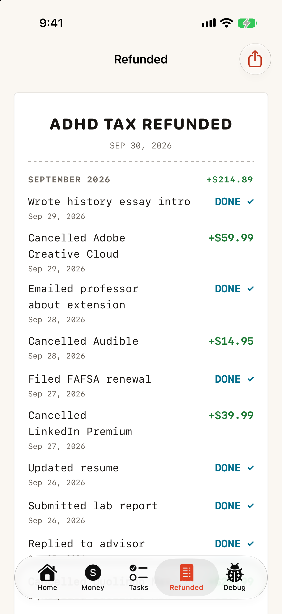
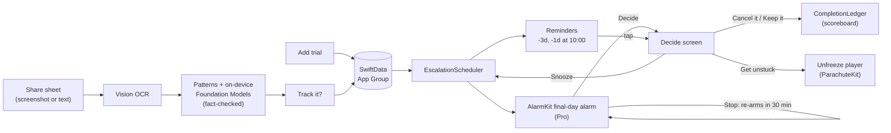

# Untax

   

**The ADHD follow-through engine.** Untax catches the money deadlines your brain loses, nudges until you act, and when you freeze, on a cancellation or an essay, walks you through one tiny step at a time. **Get your ADHD tax back.** (Formerly Parachute; code modules keep that name.)

> 79% of Americans have started a free trial meaning to cancel, and got charged anyway ([Dimers, 2026](https://www.dimers.com/press/news/how-far-americans-will-go-for-freebies)). For ADHD brains the problem isn't remembering. It's **starting**.

_Built for the [RevenueCat Shipaton 2026](https://revenuecat-shipaton-2026.devpost.com/) Next Gen Award._

  
  
  
  
  

Home · Catch from a screenshot · Decide · Get unstuck · Refunded receipt. Screenshots use demo data.

## How it works
1. **Catch:** share a screenshot of a trial confirmation; on-device AI finds the service, price, and end date.
2. **Nudge:** widget countdown → reminders → a final-day alarm that keeps coming back until you decide.
3. **Decide:** Cancel · Keep · Snooze · 🧊 **Get unstuck**
4. **Unfreeze:** one tiny, exact step at a time ("Step 1: Open Settings. That's it.") for cancellations *and* deadline tasks.
5. **Reward:** every win goes on the **ADHD Tax Refunded** scoreboard.

## Built with
SwiftUI · SwiftData · AlarmKit · Apple Foundation Models (on-device) · Vision · AVSpeechSynthesizer + AVAudioEngine · WidgetKit · RevenueCat

## How RevenueCat is used
RevenueCat powers every purchase in Untax and decides what Pro unlocks. All of it lives in `Packages/MoneyKit`.

| What | How | Where |
|---|---|---|
| **Setup** | `purchases-ios` pinned at **5.91.0** via SPM. `Purchases.configure(withAPIKey:)` runs once at launch, **only in Debug**, with a **Test Store** key read from a gitignored `Config/Secrets.xcconfig`. Release builds carry no key (the SDK deliberately crashes a release build that uses a Test Store key). | `Entitlements/RevenueCatBootstrap.swift`, `Config/*.xcconfig` |
| **Offerings, not hard-coded prices** | The paywall renders whatever is in the **current offering** (`Purchases.shared.offerings().current`), sorted lifetime → yearly → monthly, with localized prices from each `StoreProduct`. Changing prices or plans is a dashboard change, not an app update. | `Paywall/PaywallView.swift` |
| **One entitlement** | Every product unlocks the **`parachute_pro`** entitlement. `ProEntitlements` listens to `customerInfoStream` and exposes `isPro`, so the UI updates the moment a purchase, restore, renewal, or expiry lands. | `Entitlements/ProEntitlements.swift` |
| **Purchase + restore** | `purchase(package:)` and `restorePurchases()`, with plain-language results ("Nothing was charged"). | `Paywall/PaywallView.swift` |
| **Gating** | `ProEntitlements` is also the shared `EntitlementsProviding` protocol, so the unfreeze module (`ParachuteKit`, Dev B) gates its Pro features without importing RevenueCat. Money side: free keeps 5 open trials, reminders, and hand-checked cancel steps; Pro adds unlimited trials and the **final-day alarm** (armed or disarmed the moment Pro changes). | `ProFeatures`, `SharedKit/Protocols/EntitlementsProviding.swift` |
| **Our own trial, honestly** | If `parachute_pro` is in a **trial period** that will renew, Untax schedules a local notification **24 hours before its own trial ends**, using the entitlement's `expirationDate` and `periodType`. An app about forgotten trials shouldn't be one. | `ProEntitlements.scheduleTrialReminder` |

**Pricing:** **$29.99 lifetime** is the headline ("We'd never charge a subscription to fix your follow-through"), with $24.99/yr and $3.99/mo as options. "Your first step is always free."

## Money path architecture

- **The alarm can't be silenced for good, only answered.** AlarmKit alerts have a Stop button plus one custom button. Stop runs an App Intent that schedules the next ring 30 minutes later (even if the app was force-quit); **Decide** opens the app. Only a recorded decision ends the chain.
- **Apple-billed trials move a day earlier.** Apple asks for cancellation "at least a day before each renewal date", so reminders and the alarm count down to the day before the charge.
- **Capture never invents facts.** Pattern matching always runs, so capture works without Apple Intelligence. When the on-device model is available it may choose among the prices and dates printed in the screenshot, but anything it returns that isn't printed there is dropped. Scored with `TrialCaptureEval` on committed fixtures (`Packages/MoneyKit/Fixtures/`).
- **MoneyKit never imports ParachuteKit.** "Get unstuck" is a closure; the app target wires the two packages together through the protocols in `SharedKit` (`docs/interfaces.md`).

## Build and run
1. Xcode 27 (iOS 27 SDK), an iPhone on iOS 26 or later, and [XcodeGen](https://github.com/yonaskolb/XcodeGen) (`brew install xcodegen`).
2. `cp Config/Local.xcconfig.example Config/Local.xcconfig` and set your team ID and a bundle prefix of your own. A free Apple ID works.
3. Optional, for purchases: `cp Config/Secrets.xcconfig.example Config/Secrets.xcconfig` and paste a RevenueCat **Test Store** key (Debug only).
4. `xcodegen generate`, open `Parachute.xcodeproj`, and run on your iPhone. AlarmKit needs a real device.
5. Tests: `xcodebuild -project Parachute.xcodeproj -scheme Parachute -destination 'platform=iOS Simulator,name=iPhone 17 Pro' test`. Capture eval (Mac with Apple Intelligence): `swift run --package-path Packages/MoneyKit TrialCaptureEval Packages/MoneyKit/Fixtures/TrialScreenshots`.

## Try it
- **Real iPhone recommended.** AlarmKit alarms only ring on a device, and the AI task steps need an Apple Intelligence iPhone.
- **Simulator works** for everything else. Without Apple Intelligence the task steps are hand-written fallback templates and screenshot reading uses pattern matching.
- **Demo data:** Debug build → Home → 🐞 → "Reset & seed demo data".

## Privacy
Everything stays on the phone: no account, no server, no analytics. Screenshots are read with on-device Vision and Apple's on-device model. The only network traffic is RevenueCat, for purchases.

## Repo guide
- `PLAN.md`: product, research, verdict, architecture
- `MILESTONES.md`: who builds what, day by day
- `PROJECT.md`: current status
- `docs/interfaces.md`: contracts between the money (`MoneyKit`) and unfreeze (`ParachuteKit`) modules
- `docs/brand/BRAND.md`: logo, colors, type and voice
- `docs/readme-dev-b.md`: **unfreeze architecture**, how the Unfreeze engine and on-device atomizer work (+ architecture diagram)
- `docs/b0-atomizer-spike.md`: the on-device AI test plan and results
- `research/`: background evidence

## License
MIT; see `LICENSE`.
