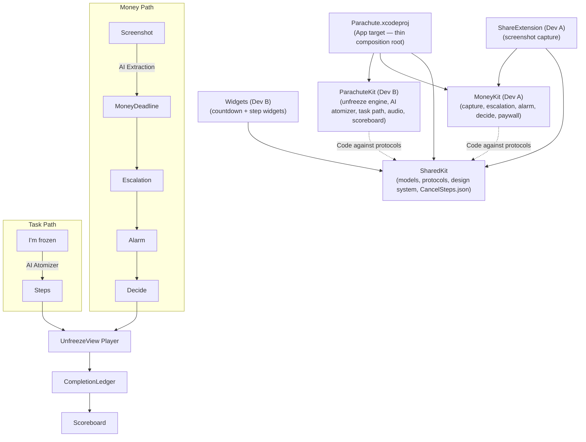

## Foundation Models & The Unfreeze Engine

### How Foundation Models Are Used
Parachute leverages Apple's on-device Foundation Models framework to intelligently break down overwhelming tasks, entirely preserving user privacy.

*   **On-Device AI (`@Generable` macro):** We use local models to parse and atomize tasks. Because it runs locally, there are no API keys to configure, it works offline, and no user data ever leaves the device.
*   **The AI Atomizer:** When a user is "frozen" on a task, the AI breaks it into micro-steps. Each step is designed to be trivially small (≤ 90 seconds) and verb-first, ensuring the crucial *first step* is always free of friction.
*   **Intelligent Fallbacks:** For unknown subscription cancellations, the AI provides "Suggested steps". It intelligently infers the process without ever inventing or hallucinating URLs.
*   **Privacy First:** Everything runs locally and offline. No data leaves the device.
*   **Graceful Degradation:** For devices lacking Apple Intelligence capabilities, Parachute gracefully falls back to generic, but concrete and actionable, step templates.
*   **Structured Output:** We utilize the `LanguageModelSession.respond(to:generating:)` API to ensure the AI returns strongly typed, structured data that our app can reliably consume.

### Parachute Architecture



### The Unfreeze Engine

The Unfreeze Engine is the core of ParachuteKit, responsible for dynamically generating an actionable `UnfreezePlan` when a user needs to tackle a deadline or a frozen task. It employs a thoughtful routing logic to guarantee the highest quality steps:

1.  **Curated Steps:** Hand-verified, pixel-perfect steps loaded from `CancelSteps.json` for known services. This is always the preferred path.
2.  **Apple Subscriptions Path:** Directs users seamlessly to the Settings app for subscriptions billed through Apple.
3.  **AI Fallback (Suggested):** If a service isn't in our curated list, we use Foundation Models to atomize the cancellation process on the fly. These are explicitly labeled as "Suggested" to manage expectations.
4.  **Non-AI Fallback:** A robust safety net providing generic, actionable steps for devices that cannot run the AI models.

**Structured Generation Snippet:**

```swift
@Generable
struct AtomizedSteps: Sendable {
    var steps: [AtomizedStep]
}

@Generable
struct AtomizedStep: Sendable {
    var text: String
    var seconds: Int
}
```
