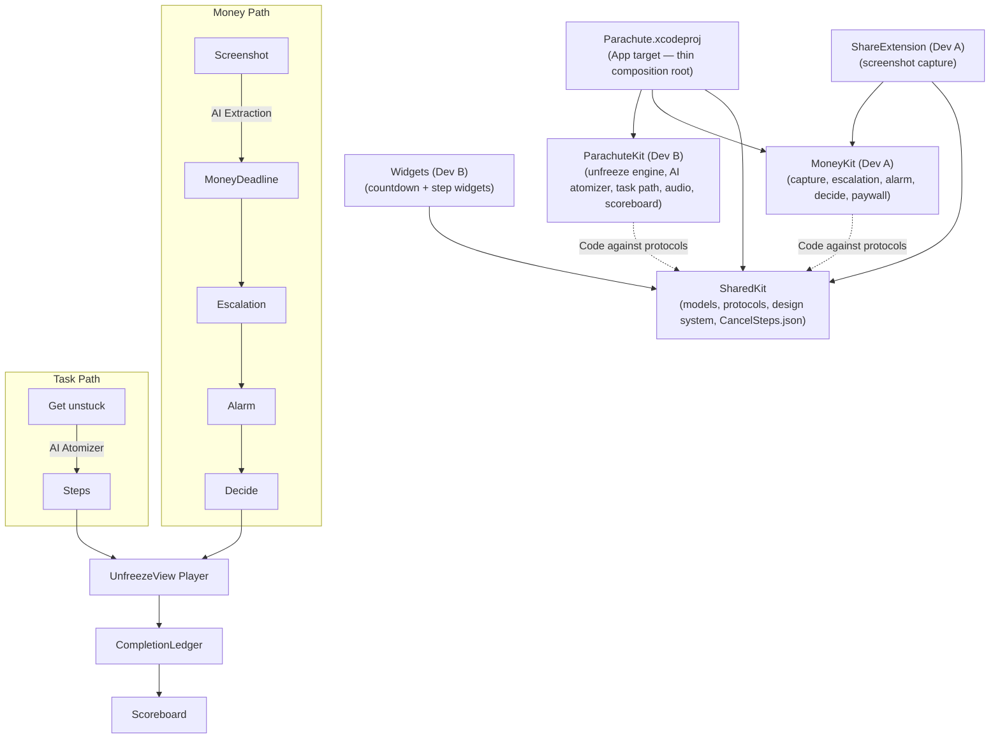

## Foundation Models & The Unfreeze Engine

### How Foundation Models Are Used
Parachute uses Apple's on-device Foundation Models framework (iOS 26+) to break a task, or the cancellation of a service we don't have curated steps for, into tiny steps.

*   **On-device, no keys:** the model runs on the phone, so there's no API key in the app and the atomizer's input never leaves the device. It needs an Apple Intelligence-capable device with Apple Intelligence turned on.
*   **Structured output:** `LanguageModelSession.respond(to:generating:)` returns a `@Generable` `AtomizedSteps` value (at most 8 steps, each with `text` and `seconds`), not free text.
*   **Tiny steps:** the instructions ask for verb-first physical actions of 90 seconds or less, with a silly-small first step, and forbid "think about / consider / plan" and any links.
*   **Sanitized:** `StepSanitizer` cleans every AI list before it's shown: URLs and bare domains are stripped, seconds are clamped to 5–90, and empty or duplicate steps are dropped.
*   **Labeled:** AI plans are shown as "Suggested steps."
*   **Non-AI fallback:** if the model is unavailable, errors, or returns nothing usable, the app serves concrete templates from `Fallbacks` instead (CLAUDE.md rule 3).
*   **Break it smaller:** re-atomizes just the current step into 2–4 smaller steps (template fallback when the model isn't available) and swaps them into the plan. It's never paywalled.

Prompt, schema, and the on-device quality check: `docs/b0-atomizer-spike.md`.

### Parachute Architecture



### The Unfreeze Engine

`UnfreezeEngine` (ParachuteKit) builds an `UnfreezePlan` for a request.

**Cancel a service**, in this order:

1.  **Curated steps** from `CancelSteps.json`, hand-verified and logged in `docs/cancel-steps-verification.md`.
2.  **Apple's subscription settings** (Settings → your name → Subscriptions) for trials billed by Apple. Apple-billed trials skip a service's web curated steps, since those only work for web signups (CLAUDE.md rule 8).
3.  **AI "Suggested steps"** from the on-device atomizer for services we haven't curated.
4.  **Non-AI template** when the model isn't available.

**A task** goes straight to the AI atomizer, with the non-AI template as fallback.

**Gating:** curated and Apple-settings plans are free. AI plans (and the templates that stand in for them) show step 1 free, then the Pro upsell. Voice and ambient sound are Pro.

**Audio:** steps are read aloud with `AVSpeechSynthesizer`; the ambient bed is brown noise generated live with `AVAudioEngine`, so there's no licensed audio.

**Structured generation schema:**

```swift
@Generable
struct AtomizedSteps {
    @Guide(description: "The tiny steps, in order. The first one takes about 10 seconds.", .maximumCount(8))
    var steps: [AtomizedStep]
}

@Generable
struct AtomizedStep {
    @Guide(description: "One physical action that starts with a verb, e.g. 'Open a blank doc. Type your name.' No links or web addresses.")
    var text: String
    @Guide(description: "Seconds it takes, from 5 to 90.", .range(5...90))
    var seconds: Int
}
```
